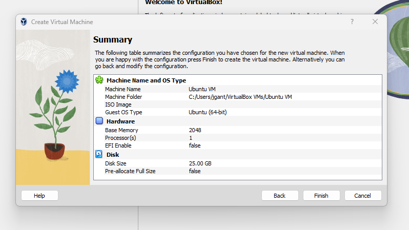

## Lab 07

- Name: John Gantner
- Email: gantner.6@wright.edu

## Part 1 Answers

1. Download an ISO:
    - Linux distribution: Ubuntu desktop
    - URL to download it: https://ubuntu.com/download/desktop
2. Virtual Machine configurations:
    - RAM - 2048 MB
    - CPU - 1 CPU
    - Disk size - 25 GB

3. Install Guest OS:
    - Start installation: To start the the installation I selected my VM and then clicked start.
    - Disk to install to: /dev/sda3
    - Partition size: 24G
    - Partition filesystem: ext4
4. Remove installation media:
    - How to remove: I went to the VM's settings, then went to storage, the under Controller: SATA I found the ISO. Then I right clicked it and selected remove attachment then clicked OK.
    - How to verify: When booting up the VM boots directly into Ubuntu.
5. Guest Additions:
    - How to insert Guest Additions: Turn on your VM, go to devices menu and then click "Insert Guest Additions CD Image".
    - How to run the Guest Additions installer for your Guest Operating System: I cd into the directory where the Guest Additions CD is mounted and then I ran: sudo ./VBoxLinuxAdditions.run. After that I rebooted the VM.
    - How to change resolution of the VM: In your VM right click on the desktop and then click on display settings. Here you can change your VM's resolution.
6. VM Control:
    - Turning on the VM:
    - Turning off the VM:
    - Restarting the VM:
7. Proof of your VM running your Guest OS:

## Part 2 Answers

1. How to change your desktop background in your VM:
2. How to install VSCode in your VM:
3. How to connect to your AWS instance from your VM using `ssh`:
