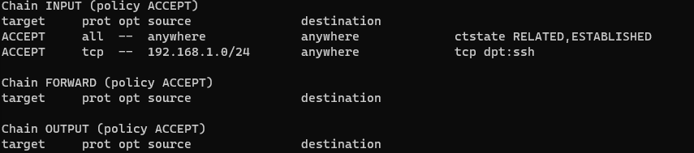

## Lab 12

- Name: John Gantner
- Email: gantner.6@wright.edu

## Part 1 Answers:

1. `tar` options:
   - `-c` Creates a new archive.
   - `-v` Verbose mode. It shows detailed output.
   - `-f` Specifies the archive filename.
   - `-z` Compresses the archive using gzip.
   - `-x` Extracts the contents of an archive.
2. Command(s): tar -cvzf DirA.tar.gz DirA

## Part 2 Answers:

1. Command: sftp -i ceg2350.pem ubuntu@44.216.84.103
2. `sftp` options:
   - `ls` List remote files.
   - `lls` List local files.
   - `put` Upload a local file to remote SFTP server.
   - `get` Download a remote file to a local machine.
3. Command(s): get /home/ubuntu/DirA.tar.gz ubuntu
4. Command(s): tar -xvzf DirA.tar.gz

## Part 3 Answers:

1. sudo adduser colin
2. ssh-keygen -t rsa -b 2048 -f ~/.ssh/new_key
3.cat /home/jgantner/.ssh new_key.pub | ssh John 'cat >> ~/.ssh/authorized_keys'
4. ssh -i ~/.ssh/new_key.pem colin@44.216.84.103

## Part 4 Answers

1. Translate to network prefixes + CIDR notation:
   - Sample: `10.0.0.0 - 10.0.1.255` = `10.0.0.0/23` OR `10.0.1.0/23`
   - `130.108.0.0 - 130.108.255.255` = 130.108.0.0/16
   - `10.0.0.0 - 10.0.0.255` = 10.0.0.0/24
   - `208.38.225.1 - 208.38.225.254` = 208.38.225.0/24
2. How you confirmed current rules are bad, and why are they bad. You can confirm these rules by checking AWS security group rules and iptables on your instance for entries allowing any IP (0.0.0.0/0) to connect to any port. This is bad practice because it exposes the instance to potential attacks, potentially leading to unauthorized access and security breaches.
3. Your implementation details and 
4. Something invalid: If for example, you built your rules to allow SSH only from 192.168.1.0/24, attempting to connect from any other IP would be considered invalid. 

## Extra Credit Answers:

### Solve the conflict

1. The output said there was a merge conflict and my merge had failed. It then said to fix conflicts then commit the result.
2. I see conflict markers like >>> indicating the conflicting changes.
3. I used the command vim Lab12/problem-child.txt to remove the >>>
4. The output said the conflicts are fixed but it's still merging. 
5. vim Lab12/problem-child.txt, git status, git add Lab12/problem-child.txt,
git commit -m "Resolve merge conflict in problem-child.txt", git merge improvements, git push origin main.

